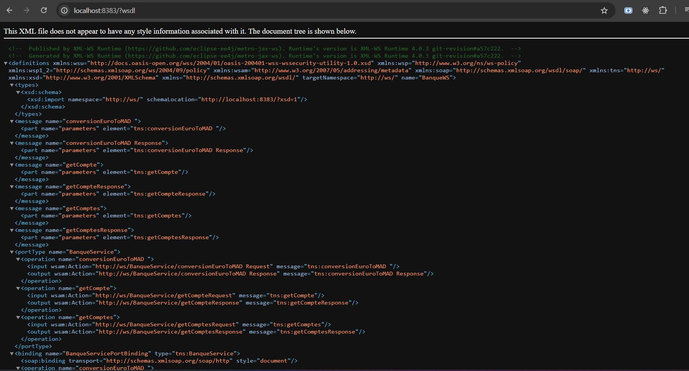
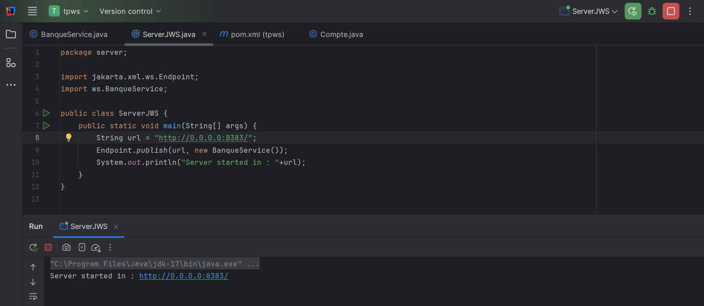
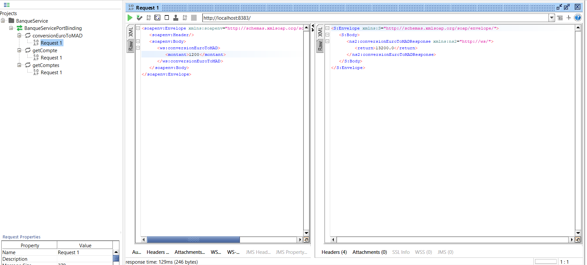
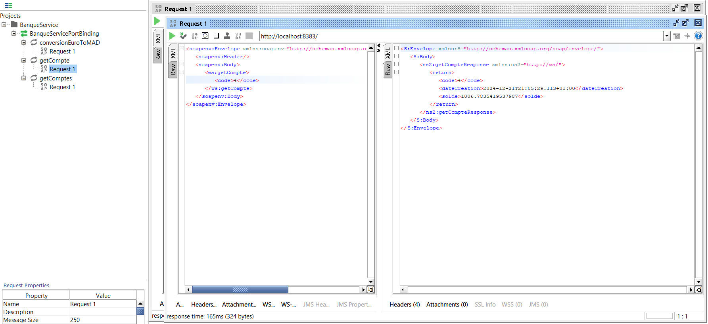
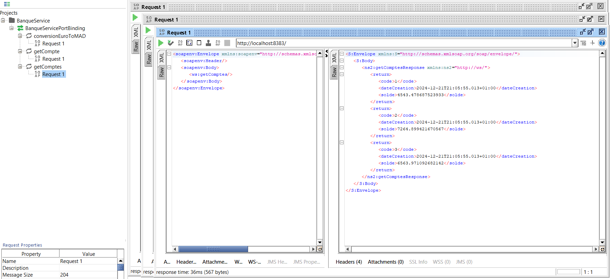
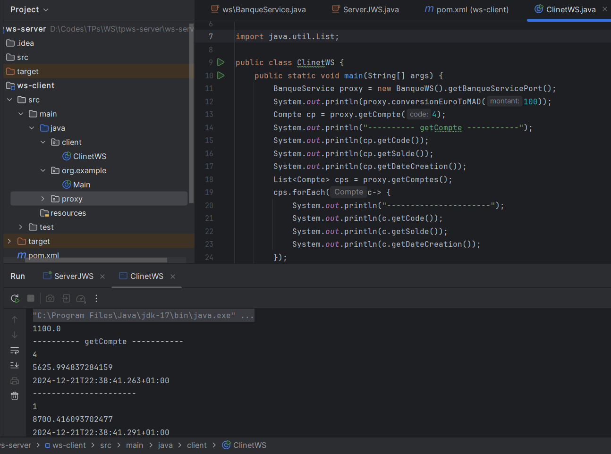
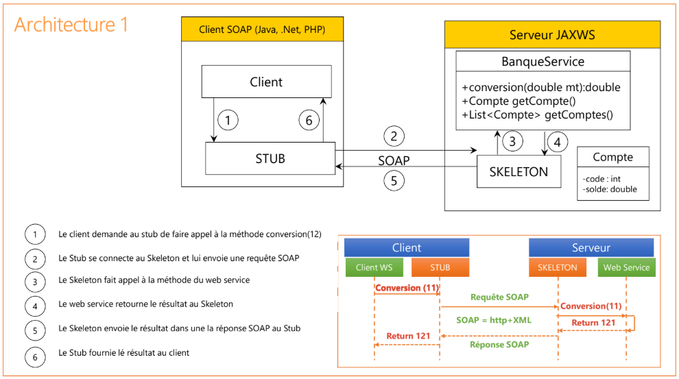

<h2>Web Services SOAP Java-Maven</h2>
<h3>WSDL du serveur JWS</h3>

<h3>La classe main du serveur JWS</h3>

<h3>Consommation via SOAPUI de la méthode de conversion Euro => MAD</h3>

<h3>Consommation via SOAPUI de la méthode GetCompte par le code</h3>

<h3>Consommation via SOAPUI de la méthode GetComptes qui liste les comptes</h3>

<h3>La méthode main du client qui consomme le JWS du serveur</h3>

<h3>L'architecture de la solution</h3>
